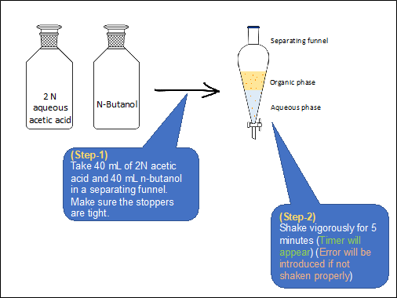
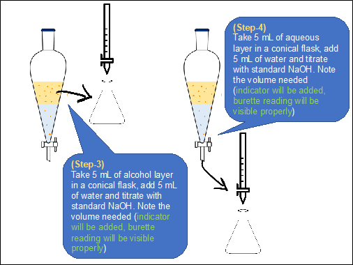
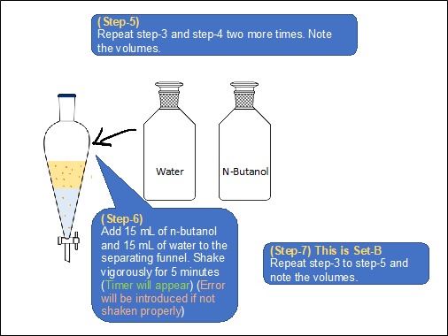
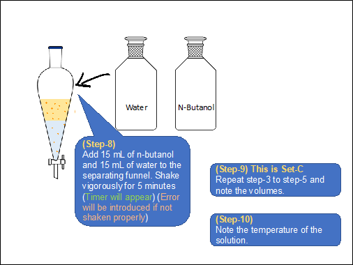
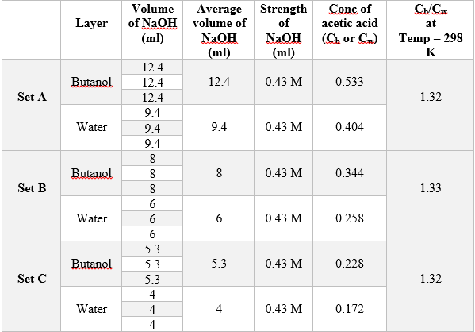

<b> Materials & Reagents Required</b> 
A.	Separating funnel (500 mL)
B.	Volumetric flask (250 mL)
C.	Measuring Cylinder (100mL)
D.	Burette (25 mL)
E.	Pipette (1mL & 5mL)
F.	Conical flask (250 mL)
<b> Procedure in laboratory diagram</b>
 
 
 
 
<b>Procedure in laboratory</b>
 
<b>Data and the analysis</b> 
Standardization of NaOH solutio 
Strength of Oxalic acid = 0.1 M (or 0.2 N) 
Indicator used = Phenolphthalein 
End point  = Colorless to pink 

 
<b>Calculation:</b>
Number of equivalents of NaOH = Number of equivalents of oxalic acid. 
 

