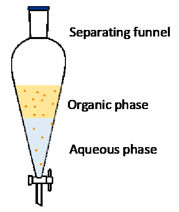

Consider that a solute is allowed to distribute between two immiscible solvents in contact with each other at a given temperture. Then,
Nernst distribution law states that, at equilibrium the ratio of the concentrations of the solute in the two solvent layers is fixed. This implies that, when a solute is shaken in two immiscible liquids, then the solute is found to be distributed between the liquids in a definite manner, provided the solute is soluble in each of the solvent. According to distribution law, the distribution co-efficient (kd) at a particular temperature is given by 
 
kd=C1/C2					(1) 

where C1 and C2 represent concentration of solute in the two immiscible liquids. If the solute exists in only one form in each of the solvents, the distribution coefficient is equal to the partition coefficient of the solute. The partition coefficient relates to the same molecular species in each phase i.e. the solute molecules in each solution phase are in the same state of association. 

In this experiment, acetic acid will be partitioned between butanol (organic solvent) and water. The concentration of the acid in both the phases will be determined by titrating against a standard base using an acid base indicator. The concentration of the solute is varied by adding additional equal quantities of fresh butanol and water and  the partition coefficient is recalculated.

